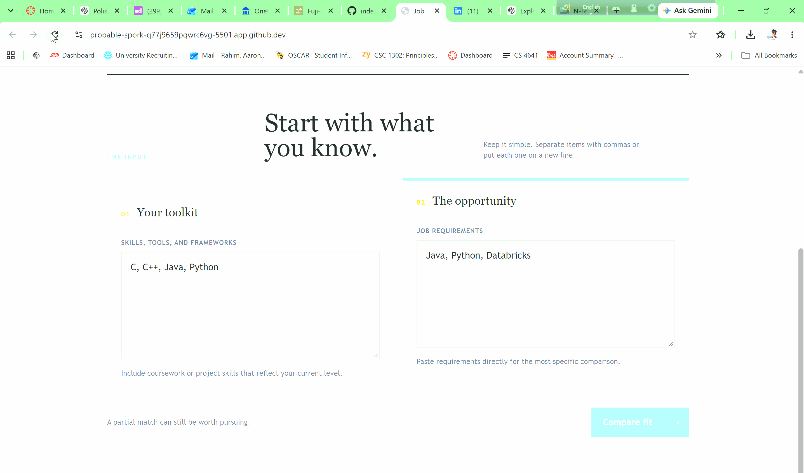
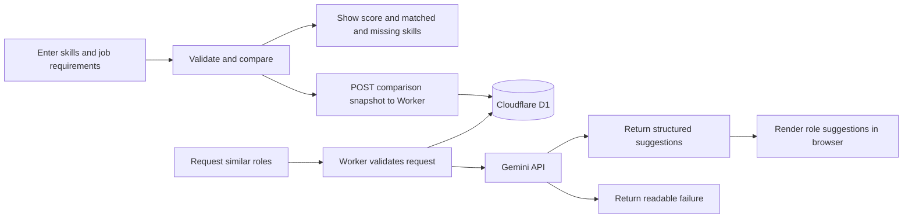
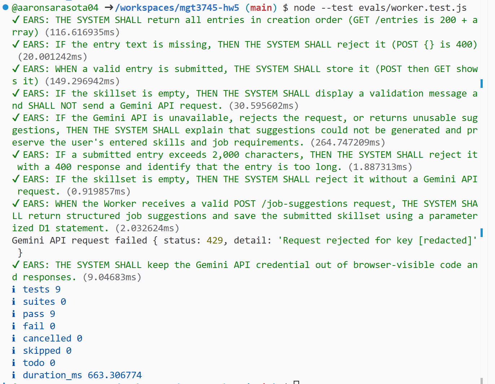

# Job Match Checker

## What

Job Match Checker helps a graduating CS student decide which technical roles are worth pursuing by comparing skills with requirements and using the delegated Gemini feature to suggest related roles; see the [HW4 repository](https://github.com/aaronsarasota04/mgt3745-hw4), [PROJECT.md](context/PROJECT.md), and [FEATURES.md](context/FEATURES.md). Draft inputs stay in browser `localStorage`; evaluating a match sends the submitted lists through the Cloudflare Worker to D1, and role-suggestion requests and API results are also stored there, as described in [ADR-002](context/ARCHITECTURE.md#adr-002).

## See It Work



The animation shows the input form. The cleared-cache persistence check is recorded in [FEATURES.md verification](context/FEATURES.md#verification); this capture does not show the cache being cleared.



## How to Run

- Published app: [Job Match Checker](https://aaronsarasota04.github.io/mgt3745-hw5/)
- Deployed: [Cloudflare Worker](https://mgt3745-hw4.arahim.workers.dev/entries)

From a fresh Codespace:

1. Run `npm install`.
2. Run the Worker code eval against the deployed Worker:

   ```sh
  API=https://mgt3745-hw4.arahim.workers.dev npm test
   ```

3. Run the full browser and Worker suite with `npm run test:unit`. The Worker tests write records to the shared D1 database and exercise the configured Gemini failure path; run them when the deployed services are available. The latest `npm test` run passed all 9 Worker tests, and `npm run test:unit` passed all 20 tests, with no skips.



To run the Worker locally instead: `npm run dev` (port 8787, local D1 emulator).

## Status

| Area | Evidence | Status |
|---|---|---|
| Skill comparison, validation, result lists, and reload draft (EARS 1-8) | Eight named tests in `app.test.js` | PASS |
| Worker input validation, structured suggestion response, parameterized D1 write, and credential redaction | 9 Worker tests in `evals/worker.test.js`; 20 combined browser and Worker tests in `npm run test:unit` | PASS |
| Cleared-cache persistence | Manual browser check recorded in [FEATURES.md verification](context/FEATURES.md#verification) | PASS |
| Deployed Worker integration | `API=https://mgt3745-hw4.arahim.workers.dev npm test`: 9 passed, 0 skipped | PASS |
| Worker 400 messaging | The entries-save path labels every `/entries` 400 “text too long”; suggestions label every 400 as missing skills | KNOWN ISSUE; logged in [EVALS.md](context/EVALS.md) |
| Concurrent writes from multiple clients | Concurrency behavior is not defined in [ADR-002](context/ARCHITECTURE.md#adr-002) | DEFERRED |

Full acceptance criteria and verification evidence are in [FEATURES.md](context/FEATURES.md) and [EVALS.md](context/EVALS.md).

## Links

Repository: [mgt3745-hw5](https://github.com/aaronsarasota04/mgt3745-hw5). The Worker base URL is `https://mgt3745-hw4.arahim.workers.dev`.

Reading order: [PROJECT.md](context/PROJECT.md) → [USERS.md](context/USERS.md) → [FEATURES.md](context/FEATURES.md) → [ARCHITECTURE.md](context/ARCHITECTURE.md) → [STANDARDS.md](context/STANDARDS.md) → [TOOLS.md](context/TOOLS.md) → [STYLE.md](context/STYLE.md) → [EVALS.md](context/EVALS.md) → [SKILLS.md](context/SKILLS.md) → [CLAUDE.md](context/CLAUDE.md).

### Delegation

- [DDR-001](docs/DDR-001.md): Bolt.new Gemini role-suggestion feature.
- [DDR-002](docs/DDR-002.md): Copilot 2,000-character Worker validation.
- [COMPARISON.md](docs/COMPARISON.md): AI Studio and Bolt role-suggestion comparison.

## AI Use

Bolt.new was used for the Gemini role-suggestion UI, and GitHub Copilot was used for the HW4 Worker validation change and review. [DDR-001](docs/DDR-001.md) and [DDR-002](docs/DDR-002.md) record both delegations; together, their estimates are 9 hours by hand versus 3 hours for tool runs and review, or 6 hours net saved. [COMPARISON.md](docs/COMPARISON.md) records the AI Studio and Bolt implementation comparison.