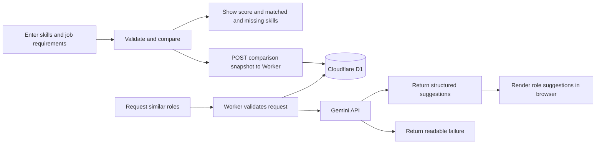

# Job Match Checker

## What

Job Match Checker helps a graduating CS student decide whether a technical role is worth pursuing while employer tool requirements keep changing. It compares user-entered skills with job requirements by normalized skill names, calculates a match percentage, lists skill gaps, and can request related roles from Gemini; see [PROJECT.md](context/PROJECT.md) and [FEATURES.md](context/FEATURES.md). Draft inputs stay in browser `localStorage`; evaluating a match sends the submitted lists through the Cloudflare Worker to D1, and role-suggestion requests and API results are also stored there, as described in [ADR-002](context/ARCHITECTURE.md#adr-002).

## See It Work


The animation shows the input form. The cleared-cache persistence check is recorded in [FEATURES.md verification](context/FEATURES.md#verification); this capture does not show the cache being cleared.



## How to Run

- Published app: [Job Match Checker](https://aaronsarasota04.github.io/mgt3745-hw5/)
- Deployed: [Cloudflare Worker](https://mgt3745-hw4.arahim.workers.dev/entries)

From a fresh Codespace:

1. Run `npm install`.
2. Run the Worker suite with `npm test`; it targets the deployed Worker URL configured in `evals/worker.test.js` by default.
3. To target a different Worker, set `API` and run `npm test`:

   ```sh
    API=https://your-worker.workers.dev npm test
   ```

Run the full browser and Worker suite with `npm run test:unit`. The default Worker suite writes test records to the shared D1 database and exercises Gemini's configured failure path, so run it when the deployed services are available. The current `npm test` run passes all nine Worker tests without skips.


To run the Worker locally instead: `npm run dev` (port 8787, local D1 emulator).

## Status

| Area | Evidence | Status |
|---|---|---|
| Skill comparison, validation, result lists, and reload draft (EARS 1-8) | Eight named tests in `app.test.js` | PASS |
| Worker input validation, structured suggestion response, parameterized D1 write, and credential redaction | Local unit tests in `evals/worker.test.js` with mocked Gemini and D1 | PASS (unit) |
| Cleared-cache persistence | Manual browser check recorded in [FEATURES.md verification](context/FEATURES.md#verification) | PASS |
| Deployed Worker integration | Five `API`-backed checks are skipped in the local unit run | NOT RUN locally |
| Worker 400 messaging | The UI currently maps every Worker 400 to a “text too long” message | KNOWN ISSUE; logged in [EVALS.md](context/EVALS.md) |
| Concurrent writes from multiple clients | Concurrency behavior is not defined in [ADR-002](context/ARCHITECTURE.md#adr-002) | DEFERRED |

Full acceptance criteria and verification evidence are in [FEATURES.md](context/FEATURES.md) and [EVALS.md](context/EVALS.md).

## Links

Repository: [mgt3745-hw5](https://github.com/aaronsarasota04/mgt3745-hw5). The Worker base URL is `https://mgt3745-hw4.arahim.workers.dev`.

Reading order: [PROJECT.md](context/PROJECT.md) → [USERS.md](context/USERS.md) → [FEATURES.md](context/FEATURES.md) → [ARCHITECTURE.md](context/ARCHITECTURE.md) → [STANDARDS.md](context/STANDARDS.md) → [TOOLS.md](context/TOOLS.md) → [STYLE.md](context/STYLE.md) → [EVALS.md](context/EVALS.md) → [SKILLS.md](context/SKILLS.md) → [CLAUDE.md](context/CLAUDE.md).

## AI Use

Bolt.new Standard was delegated the Gemini role-suggestion feature; Copilot Agent reviewed the result and supported testing and documentation. [DDR-001](docs/DDR-001.md) records the delegation and estimates 5 hours for a hand-built version, 0.25 hours for the tool run, and 2 hours for review and fixes. [COMPARISON.md](docs/COMPARISON.md) records the AI Studio and Bolt implementation comparison.