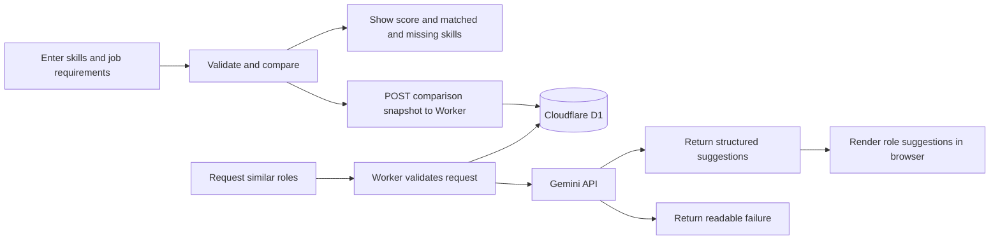

# Job Match Checker

## What

Job Match Checker helps a graduating CS student decide which technical roles are worth pursuing by comparing skills with requirements and using the delegated Gemini feature to suggest related roles; see the [HW4 repository](https://github.com/aaronsarasota04/mgt3745-hw4), [PROJECT.md](context/PROJECT.md), and [FEATURES.md](context/FEATURES.md). Draft inputs stay in browser `localStorage`; evaluating a match sends the submitted lists through the Cloudflare Worker to D1, and role-suggestion requests and API results are also stored there, as described in [ADR-002](context/ARCHITECTURE.md#adr-002).

## See It Work


The animation shows the input form. The cleared-cache persistence check is recorded in [FEATURES.md verification](context/FEATURES.md#verification); this capture does not show the cache being cleared.



## How to Run

- Published app: [Job Match Checker](https://aaronsarasota04.github.io/mgt3745-hw5/)
- Deployed: [Cloudflare Worker](https://mgt3745-hw4.arahim.workers.dev/entries)

From a fresh Codespace:

1. Run `npm install`.
2. Run the local browser and Worker tests with `npm run test:unit`. With `API` unset, these tests do not contact the deployed Worker.
3. To opt into deployed Worker integration tests, set `API` and run `npm test`:

   ```sh
    API=https://mgt3745-hw4.arahim.workers.dev npm test
   ```

With `API` unset, `npm run test:unit` reports 15 passing tests and skips five deployed-API checks. The 429 log line in the credential-redaction unit test is mocked. When `API` is set, the integration checks contact the deployed Worker, write test records to shared D1, and may make a Gemini request; run them only when you intend to use those services. The last explicit deployed run passed all 9 Worker tests.


To run the Worker locally instead: `npm run dev` (port 8787, local D1 emulator).

## Status

| Area | Evidence | Status |
|---|---|---|
| Skill comparison, validation, result lists, and reload draft (EARS 1-8) | Eight named tests in `app.test.js` | PASS |
| Worker input validation, structured suggestion response, parameterized D1 write, and credential redaction | Local unit tests in `evals/worker.test.js`; combined local run has 15 passes and 5 API checks skipped | PASS (unit) |
| Cleared-cache persistence | Manual browser check recorded in [FEATURES.md verification](context/FEATURES.md#verification) | PASS |
| Deployed Worker integration | Explicit `API=https://mgt3745-hw4.arahim.workers.dev npm test`: last run 9 passed, 0 skipped | PASS (opt-in) |
| Worker 400 messaging | The entries-save path labels every `/entries` 400 “text too long”; suggestions label every 400 as missing skills | KNOWN ISSUE; logged in [EVALS.md](context/EVALS.md) |
| Concurrent writes from multiple clients | Concurrency behavior is not defined in [ADR-002](context/ARCHITECTURE.md#adr-002) | DEFERRED |

Full acceptance criteria and verification evidence are in [FEATURES.md](context/FEATURES.md) and [EVALS.md](context/EVALS.md).

## Links

Repository: [mgt3745-hw5](https://github.com/aaronsarasota04/mgt3745-hw5). The Worker base URL is `https://mgt3745-hw4.arahim.workers.dev`.

Reading order: [PROJECT.md](context/PROJECT.md) → [USERS.md](context/USERS.md) → [FEATURES.md](context/FEATURES.md) → [ARCHITECTURE.md](context/ARCHITECTURE.md) → [STANDARDS.md](context/STANDARDS.md) → [TOOLS.md](context/TOOLS.md) → [STYLE.md](context/STYLE.md) → [EVALS.md](context/EVALS.md) → [SKILLS.md](context/SKILLS.md) → [CLAUDE.md](context/CLAUDE.md).

### Delegation

- [DDR-001](docs/DDR-001.md): Bolt.new Gemini role-suggestion feature.
- [DDR-002](docs/DDR-002.md): Copilot 2,000-character Worker validation.
- [DDR-002b](docs/DDR-002b.md): Copilot STYLE.md and comparison-note work.
- [COMPARISON.md](docs/COMPARISON.md): AI Studio and Bolt role-suggestion comparison.

## AI Use

Every delegation has a DDR under Delegation above. Hours spent on this assignment: 8

Retired text: 

**Tool and task delegated:** I used AI to debug `worker.js` and confirm that the HTTP 400 path worked as intended, update `TOOLS.md` with the tools used, bring the HW3 files into the HW4 project, update the HW3 `app.test.js` unit tests used for verification so they worked with the Worker-backed app, and proofread my drafts in the other Markdown files to polish the writing."How to Run the Worker Locally" section was generated with AI assistance, but then verified and corrected by me before submission.

**Why:** I delegated these tasks to save time, reduce the risk of errors while moving files manually, and avoid additional debugging problems because I am still becoming familiar with front-end development.

**How it was checked:** I ran the updated `app.test.js` unit tests used for HW3 verification and confirmed that all eight comparison and persistence tests passed with the HW4 fetch-backed app. For the Worker, Copilot wrote the `fieldTooLong` variable. It first parses `body.text` as JSON and then checks whether the `userSkills` or `jobText` fields are longer than 2,000 characters; if parsing fails, it falls back to checking the raw text length. I could not fully verify every possible JSON shape or malformed payload branch, so I reviewed that logic and asked Copilot to test an entry over 2,000 characters. I then manually pasted a 2,000-character entry into the website and confirmed that the deployed Worker returned HTTP 400 and the page displayed the expected validation message. I also checked that the transferred HW3 files and polished Markdown still reflected my original work and requirements. For running the worker locally, I manually did the steps it gave me to verify output.
